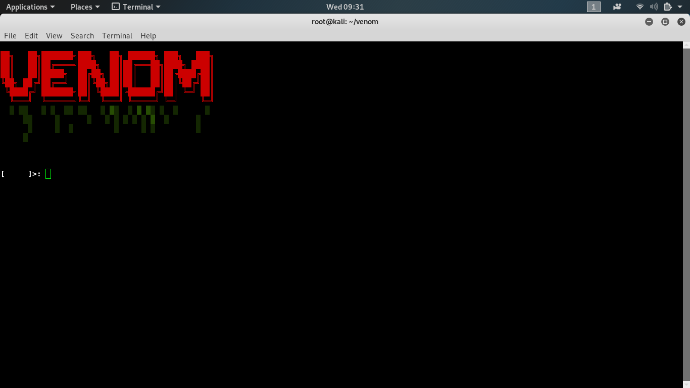
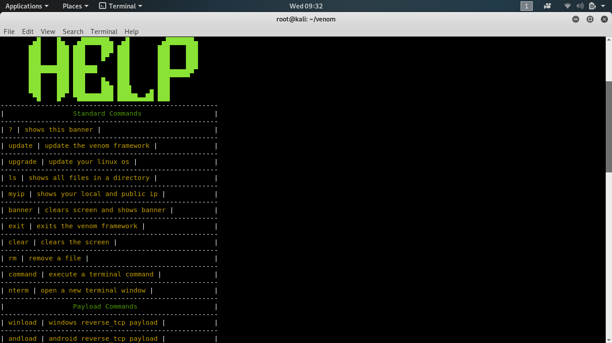

# venom
the venom framework is a framework filled with tools for wireless hacking, normal terminal commands, metasploit payloads and more i do plan on adding more things to it in the future if you would like to see updates on this and other tools i make follow me on instagram: @tuf_unkn0wn

#INSTALL

there is no install for this if your using the os kali linux there is nothing too install

#RUN

ROOT IS NOT REQUIRED TO RUN BUT IS RECOMMENDED

to run the venom framework just do these commands

* `cd venom`

* `ruby venom.rb`
